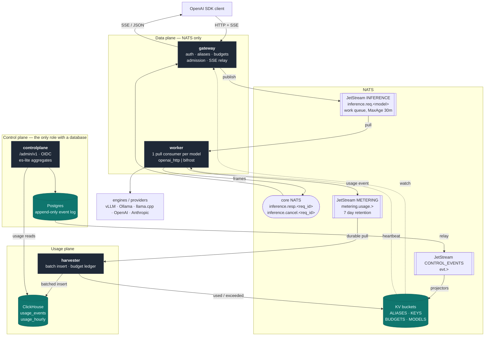
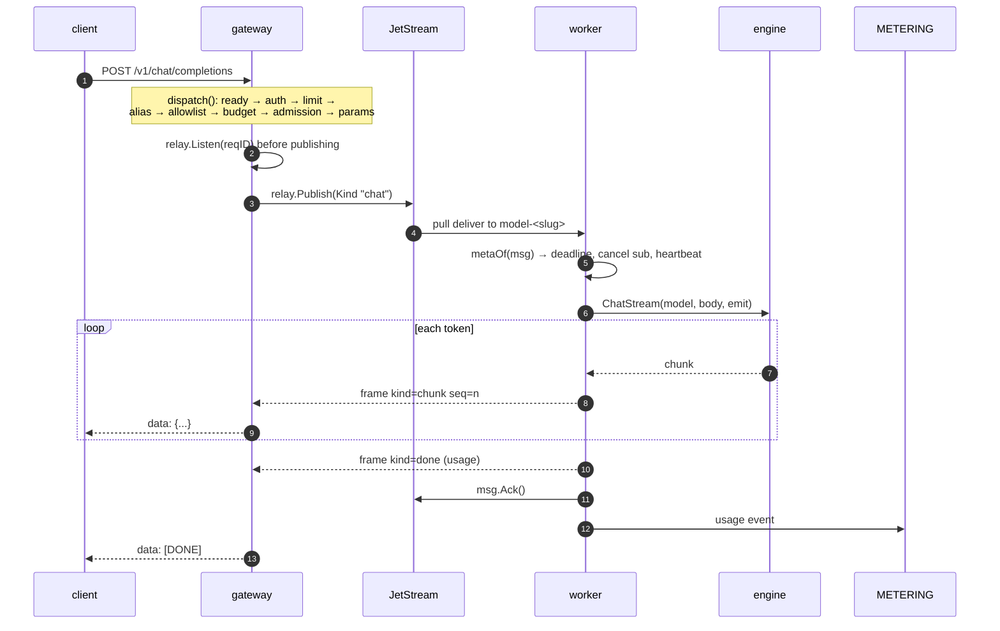
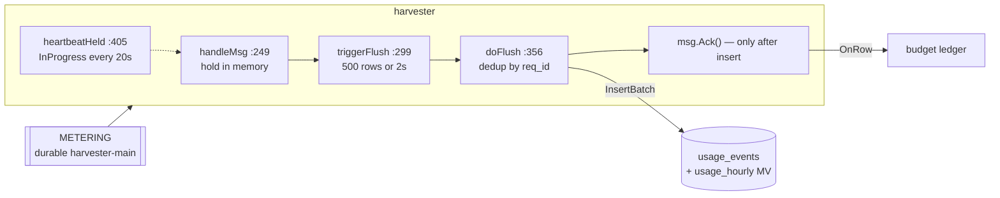
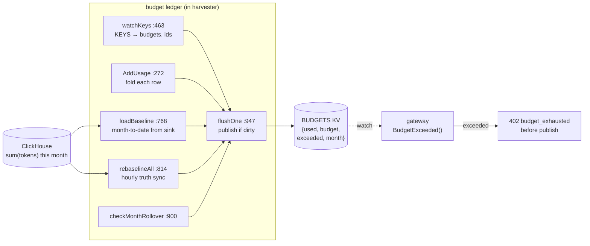

# inferbus architecture

How a request actually travels through inferbus, with the real call stacks.
Every function reference below is `file:line` against the tree this document
ships in — if a line has drifted, the symbol name is still the anchor.

Companion documents: [design.md](design.md) is the original spec;
[design-controlplane.md](design-controlplane.md) (M3),
[design-usage.md](design-usage.md) (M4), [design-hardening.md](design-hardening.md)
(M5) and [design-embeddings.md](design-embeddings.md) (M6) refine it per
milestone and win where they disagree with it.

---

## 1. The system

Four roles, one binary (`inferbus gateway|worker|controlplane|harvester`).
NATS is the only thing every role shares; nothing in the data plane touches a
database.



**The load-bearing invariant:** the gateway and worker import no database
driver at all. This is enforced mechanically in CI, not by convention:

```
go list -deps ./internal/gateway | grep -c -E "clickhouse|pgx|go-oidc"   # 0
go list -deps ./internal/worker  | grep -c -E "clickhouse|pgx|cpkv"      # 0
```

Everything the data plane needs — who may call what, which model an alias
means, whether a key is over budget — arrives as a NATS KV projection it
watches into memory. The control plane can be down while the data plane keeps
serving from its last snapshot.

### Wire contract

`internal/wire/subjects.go` is the single source of truth for names.

| | |
|---|---|
| Request subject | `inference.req.<slug>` — `wire.ReqSubject`, :48 |
| Response subject | `inference.resp.<req_id>` — `wire.RespSubject`, :49 |
| Cancel subject | `inference.cancel.<req_id>` — `wire.CancelSubject`, :50 |
| Worker consumer | durable `model-<slug>` — `wire.Durable`, :51 |
| Usage subject | `metering.usage.<org>.<project>.<model>` — `wire.UsageSubject`, :53 |
| Slugging | `wire.Slug`, :31 — applied at the subject layer only |

Headers (`Ib-*`) carry identity so the worker never parses a token:
`Ib-Org`, `Ib-Project`, `Ib-Key-Id`, `Ib-Alias`, `Ib-Req-Id`, `Ib-Kind`
(`chat`\|`embed`), `Ib-Reply`, `Ib-Deadline` (RFC3339Nano), `Ib-Worker-Id`.

Response frames are one of four kinds: `chunk` (streaming token), `done`
(stream terminator), `result` (whole non-streamed body), `error`. Exactly one
terminal frame per request.

**Model names travel verbatim.** A model is `llama3.2:latest` everywhere —
in the alias target, in the worker config, in usage rows. Only the *subject*
is slugged, on both sides, so the name never has to be sanitized by hand.

---

## 2. Chat: the streaming path

`POST /v1/chat/completions` with `"stream": true`.



### Call stack

```
Routes()                                          gateway.go:73
└─ withRequestMetrics(routeLabel(path), …)        metrics.go:123   ← status captured
   └─ withInflight(…)                             metrics.go:141   ← gauge inc/dec
      └─ (*Gateway).chatCompletions               gateway.go:359
         ├─ (*Gateway).dispatch(w, r, "chat")     gateway.go:260   ← SHARED PRELUDE
         │  ├─ checkReady                         gateway.go:151   → 503 while KV IAM cold
         │  ├─ authenticate                       gateway.go:167
         │  │  └─ iamProvider.AuthenticateKey     kviam.go:296     ← SHA-256, constant time
         │  ├─ io.ReadAll(http.MaxBytesReader)                     → 413 over 1 MiB
         │  ├─ json.Unmarshal → {Model, Stream}                    → 400 malformed
         │  ├─ iamProvider.ResolveAlias           kviam.go:309     → 404 unknown alias
         │  │                                                        yields Resolution{Target, Params}
         │  ├─ slices.Contains(key.Allow, alias)                   → 403 not allowed
         │  ├─ (*Gateway).budgetExceeded          gateway.go:111   → 402 budget_exhausted
         │  │  └─ (*KVIAM).BudgetExceeded         kviam.go:328     ← BUDGETS snapshot, no I/O
         │  ├─ (*admissionChecker).allow          admission.go:104 → 429 + Retry-After
         │  │                                                        consumer info, 1s cache
         │  ├─ mergeParams(body, res.Params)      params.go:59     ← alias overrides win
         │  ├─ relay.Listen(nc, reqID)            relay.go:65      ← subscribe BEFORE publish
         │  └─ relay.Publish(ctx, js, Request)    relay.go:30      → 503 if JetStream refuses
         └─ (*Gateway).streamOut                  gateway.go:429
            └─ (*relay.Listener).Next             relay.go:86      ← seq-gap detection
```

```
(*Worker).RunReady                                worker.go:39
└─ CreateOrUpdateConsumer(durable model-<slug>)   worker.go:76     ← AckWait 30s, MaxDeliver 2
   └─ (*Worker).handle                            worker.go:156
      ├─ metaOf(msg)                              worker.go:145    ← Ib-* headers → reqMeta
      ├─ deadline backstop (expired → ack, meter "canceled")
      ├─ nc.Subscribe(wire.CancelSubject)                          ← client disconnect
      ├─ msg.InProgress() every 10s                                ← ack heartbeat
      ├─ engine.ChatStream / engine.Chat          openaihttp.go:99 / :64
      │  └─ rewriteModel(body, concrete)          openaihttp.go:156 ← alias → real model name
      ├─ publish(chunk…) then publish(done|result|error)
      ├─ msg.Ack()                                                 ← on EVERY terminal outcome
      └─ (*Worker).meter                          worker.go:346    → METERING
```

### Why the ordering is what it is

- **Listen before Publish.** Subscribing after publishing loses the race
  against a fast worker; the first chunk would vanish.
- **Admission last.** Backlog is measured on the *concrete* model, which is
  only known after alias resolution — and there is no point rejecting a
  request for queue depth before checking whether it was even allowed.
- **Ack on every terminal outcome**, including errors and cancellations.
  An un-acked message redelivers into the same failure; `MaxDeliver: 2` means
  a crashed worker's request is retried exactly once.
- **Cancellation is three-phase**: delete the queued message by sequence if
  it never started (`relay.DeleteQueued`, :128), publish to the cancel subject
  if it is running (`relay.Cancel`, :122), and let the deadline expire as the
  backstop if both miss.

---

## 3. Embeddings: same spine, no stream

`POST /v1/embeddings` shares the entire prelude with chat — the same function,
not a copy, so auth and budget ordering cannot drift between the two endpoints.
Only the tail differs: one `result` frame instead of an SSE stream.

```
(*Gateway).embeddings                             gateway.go:402
├─ (*Gateway).dispatch(w, r, "embed")             gateway.go:260   ← IDENTICAL prelude
│  └─ … 400 invalid_request_error if "stream": true
└─ (*Gateway).resultOut                           gateway.go:498   ← awaits ONE frame
```

```
(*Worker).handle                                  worker.go:156
└─ kind == "embed"  →  engine.Embed               openaihttp.go:86
   ├─ rewriteModel(body, concrete)                openaihttp.go:156
   ├─ POST <base>/v1/embeddings
   └─ engine.ErrUnsupported → terminalError       worker.go:334    → unsupported_kind, 400
```

Usage attribution is free: `w.meter` already writes `Kind: m.kind`
(worker.go:346), so an embeddings request lands in ClickHouse as
`kind = "embed"` with `completion_tokens = 0`.

> **A bug worth remembering.** `Embed` originally posted the request body
> verbatim, reasoning that embeddings carry no alias to rewrite. They do: the
> gateway resolves an alias to a *subject* and deliberately leaves the client's
> alias in the body. Every call against a real engine failed with
> `The model 'embed-fast' does not exist`, while the entire fake-engine test
> suite stayed green — fakes ignore the model field. Only
> `internal/e2e/live_embed_test.go`, pointed at real hardware, catches this
> class of defect.

### Named resolutions

`AliasEntry.Params` turns one model into several addressable configurations.
The operator's values override whatever the client sent, because the operator
owns the alias contract:

| alias | params | what the client gets |
|---|---|---|
| `embed-native` | — | 4096-dim vector |
| `embed-hd` | `dimensions: "1024"` | 1024-dim vector |
| `embed-compact` | `dimensions: "256"` | 256-dim vector |

All three point at one worker serving one model (verified against
Qwen3-Embedding-8B on real hardware). Values are typed by a single rule in
`mergeParams` (params.go:59): a value that parses as JSON is inserted as that
JSON (`"512"` → `512`, `"true"` → `true`), anything else becomes a string.

`model` and `stream` are refused as param keys, **case-insensitively**, in
both the alias aggregate and the merge. That is not tidiness: Go's JSON
decoder matches field names case-insensitively and lets the later duplicate
win, so a param spelled `Stream` would flip the worker into streaming while
the gateway waited for a single result — hanging the request until its
deadline.

---

## 4. Harvester: usage into ClickHouse

At-least-once delivery plus a `ReplacingMergeTree` keyed on `req_id` gives
effectively-exactly-once accounting. The ordering rule is **insert, then ack**.



```
(*Harvester).Run                                  harvester.go:171
├─ CreateOrUpdateConsumer("harvester-main")       harvester.go:177  ← AckWait 60s
├─ (*Harvester).handleMsg                         harvester.go:249
│  ├─ wire.UsageEvent → Row
│  ├─ empty ReqID → (*Harvester).termInvalid      harvester.go:279  ← Term, never silent drop
│  └─ held = append(held, msg)
├─ (*Harvester).heartbeatHeld                     harvester.go:405  ← keeps held msgs alive
├─ (*Harvester).triggerFlush                      harvester.go:299  ← size or interval
│  └─ (*Harvester).doFlush                        harvester.go:356
│     ├─ in-batch dedup on ReqID
│     ├─ Sink.InsertBatch(ctx, rows)              sink.go (CHSink | FakeSink)
│     ├─ on error: NakWithDelay → redeliver
│     ├─ msg.Ack() for each held message          ← AFTER the insert lands
│     └─ OnRow(row)                               harvester.go:161  → budget ledger
└─ (*Harvester).finalFlush                        harvester.go:328  ← drain before shutdown
```

The `Sink` interface (`InsertBatch`, `MonthToDate`, `Close`) is the seam that
keeps ClickHouse out of the tests: every unit and e2e test runs against
`FakeSink`, and one env-gated test (`CP_TEST_CH_DSN`) exercises real DDL.

---

## 5. Budgets: ClickHouse is truth, KV is the projection

The gateway must never query ClickHouse — that would put a database in the
request path. Instead the harvester maintains a ledger and publishes a tiny
projection the gateway watches.



```
(*BudgetLedger).Run                               budget.go:294
├─ ensureBudgetsBucketWithBackoff                 budget.go:385
├─ (*BudgetLedger).watchKeys                      budget.go:463    ← KEYS KV, not events:
│  ├─ applyKeysSnapshot                           budget.go:637      CONTROL_EVENTS has a
│  └─ reconcileKeys                               budget.go:681      24h MaxAge; budgets
│                                                                    must outlive that
├─ (*BudgetLedger).loadBaseline                   budget.go:768    ← Sink.MonthToDate
├─ ticker → (*BudgetLedger).checkMonthRollover    budget.go:900
├─ ticker → (*BudgetLedger).rebaselineAll         budget.go:814    ← hourly re-sync
└─ ticker → (*BudgetLedger).flushOne              budget.go:947    ← version-guarded Put
```

Gateway side, entirely in-memory:

```
(*KVIAM) watches BUDGETS                          kviam.go
└─ (*Gateway).budgetExceeded                      gateway.go:111
   └─ (*KVIAM).BudgetExceeded(keyID)              kviam.go:328     ← map lookup, no I/O
```

**Budgets are advisory throttles, not invoices.** Enforcement lags usage by a
flush interval plus KV propagation, so a burst can overshoot slightly before
the 402 appears. The design accepts this: the ledger never *under*-counts, the
hourly re-baseline pulls any drift back to ClickHouse's truth, and a missing
BUDGETS entry means "no budget", so the failure mode is fail-open rather than
locking a paying customer out. Attribution is keyed on the API key's stable
**id**, not its name, so usage stays continuous across a key rotation.

---

## 6. How requests fail

| Status | Meaning | Decided at |
|---|---|---|
| 401 | key unknown or malformed | `authenticate`, gateway.go:167 |
| 403 | key's allowlist excludes this alias | `dispatch`, gateway.go:260 |
| 404 | no such alias for this org or globally | `ResolveAlias`, kviam.go:309 |
| 413 | body over 1 MiB | `MaxBytesReader` in `dispatch` |
| 402 | monthly token budget exhausted | `budgetExceeded`, gateway.go:111 |
| 429 | model backlog over `max_backlog` | `admission.allow`, admission.go:104 |
| 503 | gateway still loading KV state | `checkReady`, gateway.go:151 |
| 502 | engine rejected the request upstream | `openaihttp` error mapping |
| 400 | `unsupported_kind` — engine cannot embed | `terminalError`, worker.go:334 |

Admission and budgets both reject **before** publishing, so a rejected request
never occupies queue depth. Both fail *open*: an unreachable consumer-info
call admits the request, and an absent budget entry means no budget.

---

## 7. Where to look in the code

| I want to… | Start here |
|---|---|
| follow one request end to end | `(*Gateway).dispatch`, gateway.go:260 |
| change what a worker serves | `internal/worker/config.go`, `discover.go` |
| add an engine backend | `internal/engine/engine.go` — implement 3 methods |
| change the wire contract | `internal/wire/` — subjects and headers together |
| understand alias projection | `internal/controlplane/kvproj.go` |
| add a usage column | `internal/harvester/chsink.go` DDL + `Row` |
| verify against real hardware | `internal/e2e/live_embed_test.go` |
